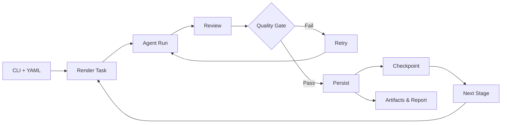

# Architecture Overview

## What This Framework Does

Policy-driven pipeline that runs **Agents** (produce artifacts) under **Advisor/Council** review (Quality Gates). Everything is defined in YAML, logged to events, cached/resumable, and produces Artifacts + Manifest at the end.

---

## Lifecycle (A→Z)

### 1. CLI + YAML
Load pipeline, policy, presets, and flags (including `--preset`, `--checkpoint-store sqlite|fs`, `--resume-run-id`, `--no-cache`).

### 2. Render Task
Task template (Jinja2) is populated from SharedMemory values.

### 3. Agent Run
`agent.process(task, context)` returns `AgentOutput(content, artifacts, metadata)`.

### 4. Review
Single **Advisor** or **AdvisorCouncil** (weights/decision) returns `AdvisorReview(score, approved, ...)`.

### 5. Quality Gate
Compare to threshold (from policy/agent). If failed → retries; if passed → persist + checkpoint.

### 6. Artifacts & Report
Write artifacts to stage directories, `manifest.json`, `SUMMARY.md`, and (optionally) ZIP Packager.

### 7. Resume/Cache
Can resume from previous run (FS/SQLite); cache key includes `agent_version` for invalidations.

### 8. Parallel
DAG calculated into waves; each wave runs in parallel when there are no dependencies.

---

## Flow Diagram



**Pipeline Example Flow:**

```
ProductDefinition → CodeSkeleton → { StaticLint, AccessibilityAudit } → Documentation → PackageZIP
                                                                    ↓
                                                              Documentation
```

---

## Key Components

### Orchestrator

**Responsibilities:**
- Render task → Execute Agent → Review Advisor/Council → Gate/Retry → Persist → Checkpoint/Eventlog
- Support for timeouts, retries, thresholds per category via policy
- Cache with `agent_version` (invalidates when agent is upgraded)
- Profiling: `duration_ms` per stage in report

**Key Methods:**
- `run(steps: List[PipelineStep])` - Executes pipeline sequentially
- `_render_task(template, memory)` - Renders Jinja2 template with memory values
- `_execute_step(step)` - Runs agent, advisor, quality gate, retry logic

**Policy Integration:**
```python
# Thresholds per category
threshold = policy.score_thresholds.get(step.category) or agent.min_advisor_score

# Timeouts per category
timeout = policy.timeouts.get(step.category) or self.agent_timeout_sec

# Retries per category
max_retries = policy.retries.get(step.category) or step.max_retries
```

### SharedMemory

**Namespace by stage:**
- `{stage}.content` - Main output content (string)
- `{stage}.artifacts[]` - List of artifact paths
- `{stage}.metadata` - Agent metadata (dict)
- `{stage}.score` - Advisor review score
- `{stage}.previous_content` - For diff comparison
- `{stage}.approved` - Boolean approval status

**Usage in Templates:**
```yaml
task: "Create architecture based on: {requirements.content}"
# Renders to: "Create architecture based on: [PRD content...]"
```

### Policy (YAML)

**Structure:**
```yaml
policy:
  score_thresholds:
    requirements: 0.80
    codegen: 0.90
  timeouts:
    requirements: 120  # seconds
  retries:
    requirements: 2
  advisors:
    requirements:
      list: [RequirementsAdvisor, ProductAdvisor]
      decision: majority  # or "average"
      weights:
        RequirementsAdvisor: 2.0
        ProductAdvisor: 1.0
  version: 1
```

**Priority Order:**
1. Policy category threshold > Agent default threshold
2. Policy timeout > Default timeout
3. Policy retries > Stage retries

### Checkpoints

**Storage Backends:**
- **FileSystem** (`FileCheckpointStore`) - Default, human-readable
- **SQLite** (`SQLiteCheckpointStore`) - WAL mode, faster queries

**Key Methods:**
- `save(checkpoint: Checkpoint)` - Persist checkpoint
- `find_last_key(run_id: str)` - Find latest checkpoint for run
- `find_key(run_id: str, step_index: int)` - Find specific checkpoint
- `load(key: str) -> Checkpoint` - Restore checkpoint

**Checkpoint Structure:**
```python
Checkpoint(
    run_id: str,
    stage: str,
    step_index: int,
    memory_snapshot: dict,  # Full SharedMemory state
    timestamp: float,
    agent_output: AgentOutput,
    advisor_review: AdvisorReview
)
```

### Artifacts

**Directory Structure:**
```
out/{run_id}/
  {stage}/
    artifact1.md
    artifact2.py
  SUMMARY.md
  manifest.json
```

**Manifest Format:**
```json
{
  "run_id": "...",
  "stages": [
    {
      "stage": "requirements",
      "artifacts": [
        {
          "name": "product_definition.md",
          "path": "requirements/product_definition.md",
          "type": "text",
          "bytes": 1234,
          "sha256": "..."
        }
      ]
    }
  ]
}
```

**Packaging:**
- ZIP Packager Agent creates `package.zip` with:
  - All artifacts
  - `MANIFEST.txt` (human-readable)
  - `SUMMARY.md` (pipeline report)

### Cache

**Cache Key Components:**
- Agent name
- Stage name
- Task template (rendered)
- Memory context (relevant keys only)
- Agent version (for invalidation)

**Invalidation:**
- Agent version change → cache miss
- Different memory context → cache miss
- Manual: `--no-cache` flag

**Cache Hit Flow:**
1. Check cache with key
2. If hit → reconstruct `AgentOutput` from cache
3. Skip agent execution
4. Still run advisor (for consistency)
5. Emit `cache_hit` event

---

## Data Shapes

### AgentOutput

```python
AgentOutput(
    content: str,  # Main output content
    artifacts: list[Artifact],  # Artifact(name, path, type="text|binary|image|zip")
    metadata: AgentMetadata  # agent_name, version, extras...
)
```

**Artifact:**
```python
Artifact(
    name: str,
    path: str,  # Relative to project root
    type: Literal["text", "binary", "image", "zip"] = "text"
)
```

**AgentMetadata:**
```python
AgentMetadata(
    agent_name: str,
    version: str = "0.1.0",
    extras: dict = {}  # Custom fields
)
```

### AdvisorReview

```python
AdvisorReview(
    score: float,  # 0.0-1.0
    approved: bool,
    summary: str = "",
    suggestions: list[str] = [],
    critical_issues: list[str] = [],
    severity: Literal["low", "medium", "high"] = "low"
)
```

### AdvisorCouncil

**Decision Modes:**
- `majority` - More than half advisors approve
- `average` - Weighted average score >= threshold

**Weights:**
```yaml
weights:
  RequirementsAdvisor: 2.0  # Double weight
  ProductAdvisor: 1.0
```

**Aggregation:**
```python
# Weighted average
weighted_sum = sum(weight * review.score for weight, review in zip(weights, reviews))
total_weight = sum(weights)
avg_score = weighted_sum / total_weight
approved = avg_score >= min_score
```

---

## Typical Run Examples

### Dry-run + Graph Export

```bash
python cli.py --pipeline pipeline/production.yaml \
  --dry-run \
  --export-graph out/pipeline.dot
```

Generates Graphviz DOT file for visualization.

### Full Run (Sequential)

```bash
python cli.py --pipeline pipeline/production.yaml \
  --mem 'product_idea="Todo App"' \
  --save-artifacts \
  --output human
```

Runs all stages sequentially, saves artifacts, outputs Markdown report.

### Resume Last Run

```bash
python cli.py --pipeline pipeline/production.yaml \
  --resume-run-id <run_id>
```

Finds latest checkpoint for run_id, restores memory, continues from last completed stage.

### Parallel Waves

```bash
python cli.py --pipeline pipeline/production.yaml \
  --parallel \
  --max-workers 4
```

Calculates DAG waves, runs each wave in parallel (up to max_workers concurrent stages).

---

## Deep-Dive: Orchestrator Decisions

### Council Decision Logic

**Majority Mode:**
```python
approved_votes = sum(1 for r in reviews if r["approved"] and r["score"] >= min_score)
approved = approved_votes > (len(reviews) // 2)
```

**Average Mode (Weighted):**
```python
if weights:
    weighted_sum = sum(weight * review.score for weight, review in zip(weights, reviews))
    total_weight = sum(weights)
    avg_score = weighted_sum / total_weight
else:
    avg_score = sum(r.score for r in reviews) / len(reviews)
approved = avg_score >= min_score
```

### Thresholding

**Priority Order:**
1. Policy category threshold (if exists)
2. Agent `min_advisor_score` (default: 0.85)

```python
threshold = agent.min_advisor_score
if policy and step.category:
    policy_threshold = policy.score_thresholds.get(step.category)
    if policy_threshold is not None:
        threshold = policy_threshold
```

### Retries

**Retry Conditions:**
- `score < threshold` → Retry
- `approved == False` → Retry
- `timeout` → Retry (if retries remaining)
- `invalid_output` → Retry (if retries remaining)

**Error Reasons:**
- `"timeout"` - Agent exceeded timeout
- `"invalid_output"` - Agent returned invalid structure
- `"exhausted_retries"` - Max retries reached
- `"advisor_reject"` - Advisor rejected (score/approval)

**Retry Flow:**
```python
while attempt <= step.max_retries:
    try:
        output = run_with_timeout(agent.process, timeout)
        review = advisor.review(output)
        if review["approved"] and review["score"] >= threshold:
            break  # Success
    except TimeoutError:
        error_reason = "timeout"
    attempt += 1
```

### Budget Enforcement

**Budget Components:**
- `max_stages` - Maximum pipeline stages
- `max_runtime_sec` - Maximum total runtime
- `max_artifacts_bytes` - Maximum artifact size

**Enforcement:**
```python
if budget:
    stats = {
        "stages_completed": len(history),
        "runtime_sec": time.time() - start_time,
        "artifacts_bytes": total_artifacts_bytes
    }
    enforce_budget(budget, stats)  # Raises BudgetExceededError if exceeded
```

---

## Persistence & Observability

### Event Log

**Format:** JSONL (one JSON object per line)

**Event Types:**
- `step_start` - Stage execution started
- `cache_hit` - Cache hit (agent skipped)
- `step_complete` - Stage completed successfully
- `step_retry` - Stage retry attempt
- `error` - Error occurred

**Example:**
```json
{"event": "step_start", "run_id": "...", "stage": "requirements", "agent": "RequirementsAgent", "ts": 1234567890}
{"event": "step_complete", "run_id": "...", "stage": "requirements", "score": 0.87, "approved": true, "ts": 1234567891}
```

**Location:** `out/{run_id}_events.jsonl`

### Checkpoints

**When Saved:**
- After each successful stage (before next stage)
- Includes full memory snapshot
- Enables deterministic resume

**Resume Flow:**
1. Find last checkpoint: `checkpoint = checkpoints.find_last_key(run_id)`
2. Restore memory: `memory.restore(checkpoint.memory_snapshot)`
3. Find next stage: `next_stage_index = checkpoint.step_index + 1`
4. Continue from next stage

### Manifest

**Purpose:** Index of all artifacts for traceability

**Structure:**
```json
{
  "run_id": "abc123",
  "created_at": "2025-01-12T10:00:00Z",
  "stages": [
    {
      "stage": "requirements",
      "artifacts": [
        {
          "name": "product_definition.md",
          "path": "requirements/product_definition.md",
          "type": "text",
          "bytes": 1234,
          "sha256": "abc..."
        }
      ]
    }
  ],
  "summary": {
    "total_stages": 5,
    "total_artifacts": 12,
    "total_bytes": 45678
  }
}
```

### Profiling

**Metrics Collected:**
- `duration_ms` - Stage execution time
- `agent_duration_ms` - Agent processing time
- `advisor_duration_ms` - Advisor review time
- `cache_hit` - Boolean cache hit flag

**Report Format:**
```markdown
## Stage: requirements
- Duration: 2.3s
- Agent: RequirementsAgent (1.8s)
- Advisor: RequirementsAdvisor (0.5s)
- Score: 0.87
- Approved: ✓
```

---

## Extensibility

### Factory Pattern

**Agent Factory:**
```python
def agent_factory(name: str) -> BaseFunctionalAgent:
    # Lookup in registry
    agent_class = AGENT_REGISTRY[name]
    return agent_class()
```

**Advisor Factory:**
```python
def advisor_factory(name: str) -> BaseAdvisor:
    # Lookup in registry
    advisor_class = ADVISOR_REGISTRY[name]
    return advisor_class()
```

**Registration:**
```python
# In agent/advisor module
AGENT_REGISTRY["MyAgent"] = MyAgent
ADVISOR_REGISTRY["MyAdvisor"] = MyAdvisor
```

### Plugin Loader (Future)

**Entry Points:**
```python
# setup.py or pyproject.toml
[project.entry-points."multi_agent.agents"]
my_agent = "my_package.agents:MyAgent"

[project.entry-points."multi_agent.advisors"]
my_advisor = "my_package.advisors:MyAdvisor"
```

**Loading:**
```python
from src.orchestrator.plugin_loader import load_plugins

agents, advisors = load_plugins()
# Merges with built-in registry
```

### Presets

**Location:** `config/presets.yaml`

**Structure:**
```yaml
mvp-fast:
  score_thresholds:
    requirements: 0.75
    codegen: 0.80
  timeouts:
    requirements: 60
  retries:
    requirements: 1

production:
  score_thresholds:
    requirements: 0.85
    codegen: 0.90
  timeouts:
    requirements: 120
  retries:
    requirements: 2
```

**Usage:**
```bash
python cli.py --pipeline pipeline/production.yaml --preset mvp-fast
```

**Merging:** Preset values override pipeline defaults, CLI flags override preset.

### Pipelines Gallery

**Location:** `pipeline/gallery/`

**Examples:**
- `idea-to-zip/` - Full pipeline: idea → HTML → screenshot → ZIP
- `api-service/` - Backend API service scaffold
- `etl-pipeline/` - Data pipeline template
- `static-site/` - Static website generator

**Structure:**
```
pipeline/gallery/idea-to-zip/
  pipeline.yaml              # Main pipeline
  pipeline-marketing-first.yaml  # Variant
  pipeline-production-demo.yaml  # Variant
  preset-idea-to-zip.yaml    # Preset config
  README.md                  # Usage guide
```

---

## How to Prove It Builds "Something Real"

### A. Production Demo (Recommended)

**Setup:**
```bash
pip install playwright
playwright install chromium
```

**Run:**
```bash
python cli.py --pipeline pipeline/gallery/idea-to-zip/pipeline-production-demo.yaml \
  --mem 'product_idea="Coffee shop" brand="BlueBean" primary_color="#0ea5e9" tone="minimal" font_family="Inter"' \
  --save-artifacts \
  --output human
```

**Expected Output:**
```
out/{run_id}/
  Product Definition/
    product_definition.md
  Code Skeleton/
    index.html
    styles.css
  Screenshot/
    screenshot.png
  Package ZIP/
    package.zip  # Contains: HTML, README, lint report, a11y report, screenshot, MANIFEST
```

**Verification:**
```bash
# Integration tests
pytest tests/test_idea_to_zip_integration.py::test_production_demo_zip_completeness -q
pytest tests/test_idea_to_zip_integration.py::test_production_demo_screenshot_sanity -q
pytest tests/test_idea_to_zip_integration.py::test_production_demo_html_sanity -q
```

### B. Marketing-First (Landing Page)

**Run:**
```bash
python cli.py --pipeline pipeline/gallery/idea-to-zip/pipeline-marketing-first.yaml \
  --mem 'product_idea="Coffee gear landing" brand="GrindLab" primary_color="#16a34a" tone="playful" font_family="Poppins"' \
  --save-artifacts \
  --output human
```

**Output:** Marketing-focused landing page with hero section, CTA, features.

### Quick Verification (CI-like)

**Smoke & Validation:**
```bash
python scripts/smoke_test.py --skip-slow --json
./scripts/revalidate.sh  # or PowerShell: .\scripts\revalidate.ps1
```

**ZIP Sanity Check:**
```bash
chmod +x scripts/quick_check_production_demo.sh
./scripts/quick_check_production_demo.sh
```

**Expected:** All checks pass, ZIP contains expected files, screenshot exists.

---

## Summary

This framework provides:

1. **Policy-Driven Execution** - YAML defines behavior, not code
2. **Quality Gates** - No unreviewed output, no low-quality artifacts
3. **Observability** - Full event log, checkpoints, manifests
4. **Reliability** - Retries, timeouts, resume, cache
5. **Extensibility** - Easy to add agents/advisors via factory pattern
6. **Production-Ready** - Artifacts, reports, packaging, CI integration

**Next Steps:**
- See [PLUGIN_API.md](PLUGIN_API.md) for creating new agents/advisors
- See [CLI_USAGE.md](CLI_USAGE.md) for command reference
- See [pipeline/gallery/](../pipeline/gallery/) for example pipelines
